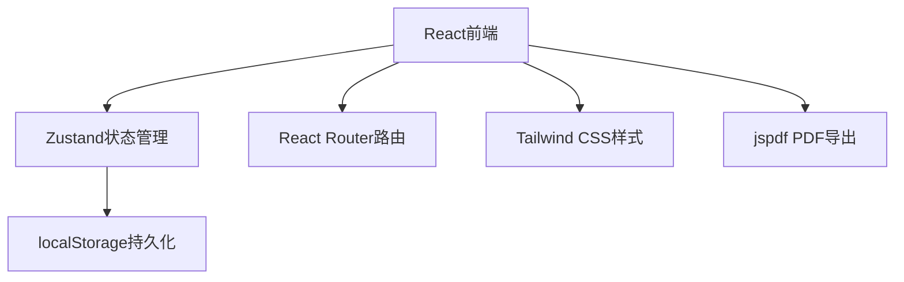
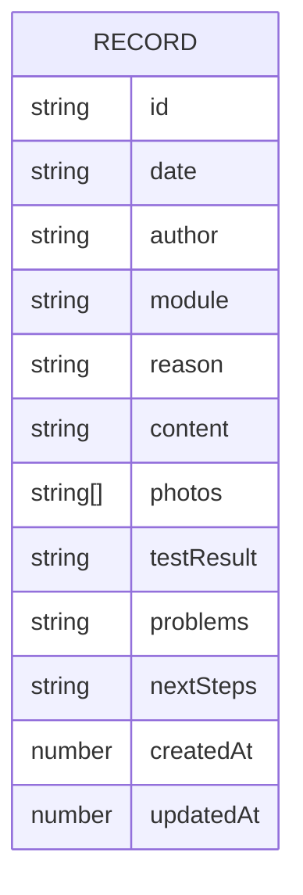

## 1. Architecture Design
纯前端应用，使用浏览器本地存储(localStorage)持久化数据，无需后端服务



## 2. Technology Description
- Frontend: React@18 + TypeScript + Tailwind CSS@3 + Vite
- State Management: Zustand
- Routing: React Router DOM
- PDF Export: jspdf
- Storage: localStorage
- Initialization Tool: vite-init

## 3. Route Definitions
| Route | Purpose |
|-------|---------|
| / | 首页 - 记录列表 |
| /record/:id | 记录详情页 |
| /new | 新建记录页 |
| /edit/:id | 编辑记录页 |
| /export | PDF导出页 |

## 4. Data Model

### 4.1 Data Model Definition



### 4.2 TypeScript Interface

```typescript
interface Record {
  id: string;
  date: string;
  author: string;
  module: '底盘' | '抓手' | '弹射' | '升降' | '其他';
  reason: string;
  content: string;
  photos: string[];
  testResult: string;
  problems: string;
  nextSteps: string;
  createdAt: number;
  updatedAt: number;
}
```

### 4.3 Zustand Store

```typescript
interface Store {
  records: Record[];
  language: 'zh' | 'en';
  addRecord: (record: Omit<Record, 'id' | 'createdAt' | 'updatedAt'>) => void;
  updateRecord: (id: string, record: Partial<Record>) => void;
  deleteRecord: (id: string) => void;
  setLanguage: (lang: 'zh' | 'en') => void;
}
```
