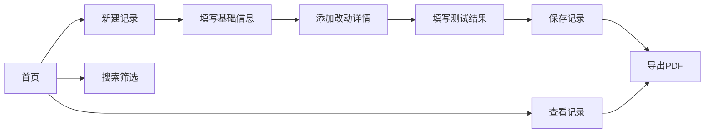

## 1. Product Overview
VEX机器人结构改动记录应用，用于记录单支队伍机器人机械结构的每次改动，自动归档，作为VEX比赛工程笔记的核心素材。
- 解决手写繁琐、记录混乱问题，追溯结构迭代轨迹，避免重复踩坑
- 目标用户：VEX机器人竞赛学生团队

## 2. Core Features

### 2.1 Feature Module
1. **首页**：改动记录列表、搜索筛选、新建记录按钮
2. **记录详情页**：查看单条完整记录、编辑/删除功能
3. **新建/编辑页**：表单式记录添加与编辑
4. **PDF导出页**：预览和导出工程笔记PDF

### 2.3 Page Details
| Page Name | Module Name | Feature description |
|-----------|-------------|---------------------|
| 首页 | 记录列表 | 卡片式展示所有改动记录，按时间倒序排列 |
| 首页 | 搜索筛选 | 按模块、日期范围筛选记录 |
| 新建/编辑页 | 基础信息 | 日期选择、负责人输入、模块下拉选择 |
| 新建/编辑页 | 改动详情 | 改动原因、内容编辑、照片上传 |
| 新建/编辑页 | 测试结果 | 效果、问题、优化方向输入 |
| PDF导出页 | 预览导出 | PDF预览、一键导出、中英文切换 |

## 3. Core Process
用户进入应用 → 浏览/搜索记录 → 新建/编辑记录 → 添加照片和详情 → 导出PDF工程笔记

## 4. User Interface Design
### 4.1 Design Style
- Primary color: 苹果蓝 (#007AFF)
- Secondary color: 深灰 (#1D1D1F)
- Button style: 圆角矩形，轻微阴影
- Font: SF Pro / PingFang SC
- Layout style: 卡片式布局，留白充足
- Icon style: 简约线性图标

### 4.2 Page Design Overview
| Page Name | Module Name | UI Elements |
|-----------|-------------|-------------|
| 首页 | 顶部导航 | 品牌Logo、中英文切换、新建按钮 |
| 首页 | 记录列表 | 卡片网格、悬停动画、缩略图预览 |
| 新建/编辑页 | 表单 | 分组布局、分步引导、实时保存 |
| PDF导出页 | 预览区域 | 文档预览、导出选项、模板选择 |

### 4.3 Responsiveness
Desktop-first，自适应平板和移动设备
